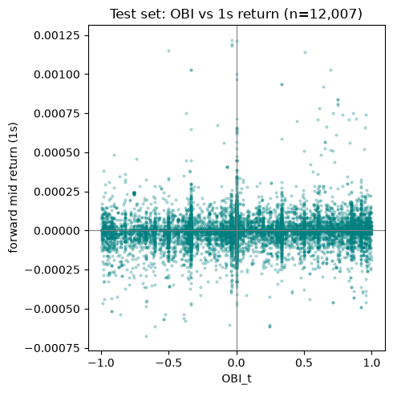
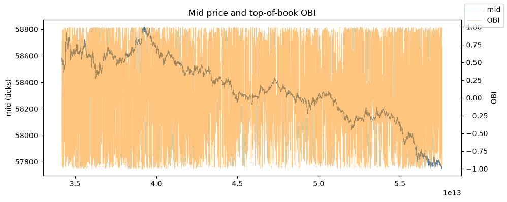

# Limit Order Book Engine

C++20 limit-order-book with O(1) cancel (pre-allocated memory pool, `order_id` hash map, FIFO price levels). The same core supports:

- **Replay** — reconstruct book state from LOBSTER-style ADD / CANCEL / EXECUTE messages
- **Match** — price-time priority matching for incoming limit orders

Python utilities clean and fetch data. A Jupyter notebook measures top-of-book **order book imbalance (OBI)** against short-horizon mid-price returns on a real AAPL LOBSTER sample day.

This is an educational / portfolio implementation with low-latency-inspired constraints (no heap allocation on the hot path, no sorting the live book). It is not a production matching engine or a trading strategy.

## Architecture

```text
messages (LOBSTER / synthetic)
        │
        ▼
python/clean_messages.py  ──►  events.csv
        │
        ▼
build/lob_engine  (replay | match)
        │
        ├── snapshots_*.csv
        └── fills.csv (match mode)
        │
        ▼
notebooks/obi_study.ipynb
```

| Path | Role |
|------|------|
| `include/lob/`, `src/` | Order book library and CLI |
| `tests/` | Correctness tests and cancel microbenchmark |
| `python/` | HF LOBSTER download, cleaners, synthetic generator |
| `notebooks/` | OBI analysis |
| `data/` | Local CSVs (gitignored) |

## Build

```bash
make -j && make test
```

Produces `build/lob_engine` and `build/lob_tests`.

```bash
cmake -S . -B build -DCMAKE_BUILD_TYPE=Release
cmake --build build -j
ctest --test-dir build --output-on-failure
```

## Data

### Real LOBSTER sample (AAPL 2012-06-21)

Source: [`totalorganfailure/lobster-data`](https://huggingface.co/datasets/totalorganfailure/lobster-data) on Hugging Face. Files are headerless; download via the Hub resolve API (not `datasets-server` first-rows).

```bash
python3 python/fetch_hf_lobster.py --symbol AAPL --levels 10 --kind both

python3 python/clean_messages.py \
  --input data/real/AAPL_message_10.csv \
  --output data/events_real.csv \
  --format lobster --price-unit lobster

./build/lob_engine --mode replay \
  --events data/events_real.csv \
  --snapshots data/snapshots_real_engine.csv \
  --depth 5 --every-n 100 --pool-size 2000000

# Official LOBSTER book state for analysis (recommended for the notebook)
python3 python/lobster_orderbook_to_snapshots.py \
  --orderbook data/real/AAPL_orderbook_10.csv \
  --messages data/real/AAPL_message_10.csv \
  --output data/snapshots_real.csv --levels 5 --every-n 10
```

LOBSTER prices are integers equal to dollars × 10000. Use `--price-unit lobster` when cleaning.

### Synthetic

```bash
python3 python/generate_sample_data.py
python3 python/clean_messages.py \
  --input data/sample_lobster_messages.csv \
  --output data/events.csv --format lobster
./build/lob_engine --mode replay \
  --events data/events.csv \
  --snapshots data/snapshots_replay.csv --depth 5 --every-n 10
```

## Order book design

- **Price levels:** `std::map` (bids descending, asks ascending). Best bid/ask from `begin()`.
- **FIFO within a level:** intrusive doubly linked list (`prev` / `next` on `Order`).
- **Cancel:** `unordered_map<order_id, Order*>` then unlink — O(1) find + O(1) list update.
- **Allocation:** fixed `MemoryPool` of `Order` objects; no `new`/`delete` in the hot path.
- **Prices / sizes:** integer ticks and integer quantities in the engine.
- **Replay:** applies exchange messages; marketable type-1 adds that would cross are matched locally so the book stays consistent on real feeds.
- **Match:** walks the opposite side by price-time priority and rests any remainder.

## Analysis

Top-of-book order book imbalance:

```text
OBI_t = (V_bid_t - V_ask_t) / (V_bid_t + V_ask_t)
```

Forward mid return is measured at horizons of 100 ms, 1 s, and 5 s. Evaluation uses a **time-based 70/30 train/test split**; metrics below are from the test segment only.

### Results — AAPL 2012-06-21 (LOBSTER orderbook, every 10th message)

| | |
|--|--|
| Snapshots | ~40,000 |
| Session | ~6.5 hours |
| Mid range | ~$577.5 – $588.2 |

Test-set Pearson correlation, top-of-book OBI vs forward mid return:

| Horizon | Pearson r |
|---------|-----------|
| 100 ms | ~0.09 |
| 1 s | ~0.07 |
| 5 s | ~0.02 |

<p align="center">
  
</p>

<p align="center"><em>Test set: OBI vs 1-second forward mid return (n ≈ 12,000). The cloud is wide — association is weak, as the table shows.</em></p>

<p align="center">
  
</p>

<p align="center"><em>Session mid (ticks) and OBI. OBI is noisy at this scale; the signal is short-horizon, not a day-long trend overlay.</em></p>

Interpretation: a weak positive association at short horizons that decays within a few seconds. That is consistent with typical equity microstructure; it is not evidence of a profitable strategy (no transaction costs, latency, or queue position).

```bash
jupyter notebook notebooks/obi_study.ipynb
```

Default input is `data/snapshots_real.csv`. Use `data/snapshots_replay.csv` only for synthetic pipeline checks.

## Tests and benchmark

```bash
./build/lob_tests
./build/lob_tests "[bench]"
```

Coverage includes FIFO matching, partial fills, mid-list cancel, level-volume invariants, multi-level match, and a single-threaded cancel throughput benchmark (on the order of ~10⁷–10⁸ cancels/s in Release, machine-dependent).

## Engine I/O

**Events**

```text
timestamp,order_id,side,price_ticks,size,action
```

`side` in {`B`,`S`}; `action` in {`ADD`,`CANCEL`,`EXECUTE`}; `timestamp` in nanoseconds.

**Snapshots**

```text
timestamp,best_bid,best_ask,bid_px_1,bid_sz_1,ask_px_1,ask_sz_1,...
```

## License and data terms

Synthetic data is generated locally. Redistributed LOBSTER samples are subject to LOBSTER and Hugging Face dataset terms. Large CSVs under `data/` are gitignored.
